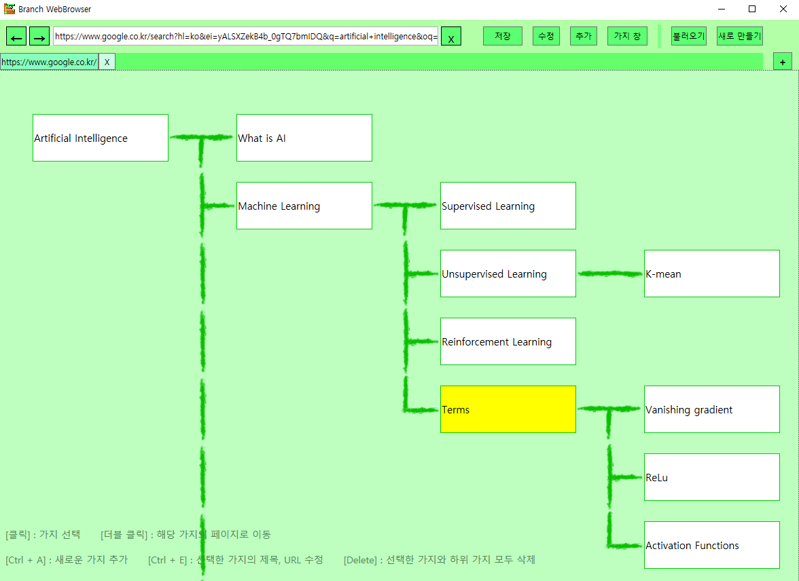

# Branch WebBrowser
Branch WebBrowser(가지 웹브라우저) is a web browser that manages bookmark with a tree.
One bookmark tree is saved in one brc file.
You can make various trees and send it to share your own tree database.

# How to use
1. Execute BranchWebBrowser
2. Click "새로 만들기" button
3. Make a brc file
4. Search something you want to add in a tree
5. Click "추가" button to add a bookmark
6. Click "저장" button to save your tree

# Used tools
- Visual Studio 2017 Community
- C# WPF
